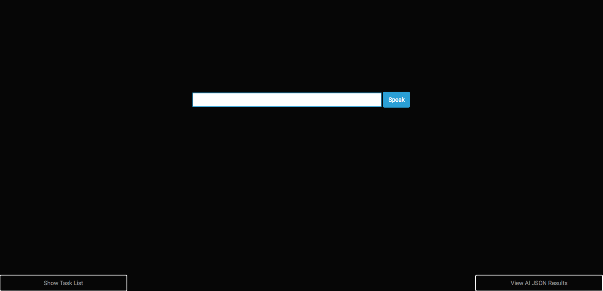

# My Chatbot

[My Chatbot](https://api.ai/)https://thawing-bayou-23300.herokuapp.com/)

### General Info:

    * Developer: Alfredo Amengual 

    * My Chatbot is an artificial intelligence powered chatbot that I made for personal use. 

### The Concept Behind the Idea: 

    * I chose this idea as my final project for General Assembly's Web Development Immersive program because I've always been fascinated by the idea of machine learning and artificial intelligence. My idea was to build a virtual personal assistant so that overtime, could help automate or make everyday tasks easier anytime I'm on the web. I tend to spontaneously have ideas as I surf the web, so rather than reminding myself on another app, I figured it would be cool to keep my chatbot's tab always open so I could ask it to generate tasks for me. 

### Technologies Used:

    * Server side: Express/Node.js
    * Database: MongoDB
    * Client side: HTML/CS, Javasscript
    * APIs:
        * API.AI (to create chatbot and establish intents/actions)
        * Chrome Web Speech API (for spoken response)
        * HTML5 Webkit Speech Recognition API (for speech input recognition)
    * Version Control: Git/Github
    * Heroku for Deployment

### Approach Taken:

    * Project time limit was 4 days
    * The first day was spent mostly planning out user stories, preconcepts, initial wire frames, and reading up on the API.AI documentation and guidelines online to draw inspiration from. I set up the bare bones skeleton of the app this day.
    * Days 2 through 4 were all about getting the functionality working. 
        * My initial thought was to style last, but I ended up styling occasionaly throughout the 2 to 4 days as a break from working on functionality. 
    * I worked on a local repo and pushed up to my remote repo piece by piece throughout the 4 days. I tried to utilize branches for each new feature added, merged them into my master repo, and then pushed to Github. My intention was for the Github version to always be a working version.

    MVP (minimum viable product) User Stories:
        * User can type in a request, chatbot responds in speech and text
        * User can hit a speak button to make a request, chatbot responds in speech and text
        * User can make small talk with chatbot
        * User can create tasks/reminders
        * User can tell chatbot action is complete

    Bonus Feature:
        * User can ask for things like weather, news, etc. 
        *** Note - for anyone interested, this is doable through API.AI via a montly subscription. Any additional features like news and weather would need to manually be done by the developer through additional outside APIS and/or manual logic.***

    Kanban Board:

    Wireframe:
        * Not much initial thoughts for the wireframe given the minimalistic idea of the project. I felt it was better to adjust as I go and learn the technology.

### Unsolved Problems:

    * As I scale out, I would like to refactor the code to make it bit drier and optimized for true SPA functionality. 
    * After you create a new task, there is a small bug on clicking to delete it. You have to refresh to then click it and it will disappear. 

### Usage/Installation Instructions:

    * Fork or clone project on your Github
    * Clone on your local computer
    * Run NPM install

    * Visit API.AI and create a new account. Follow the guidelines on creating a new agent.
    * Make sure to create a .env file to store your access token, set it equal to ACCESS_TOKEN.
    * Create a new databse on Mongolab. Store your appropritate key information in the .env file as well.
    * Run nodemon 

    ***Important note, this will only work on chrome browswers***

    ***Feel free to contact me on Github if you have any questions and I will be happy to help you through the process.***

### API.AI Additional Information:
    * [API.AI Main Site](https://api.ai/)
 

### Moving Foward:

    * What I would have done differently:
        * I would not recommend getting into this project unless you have a clear idea of what it is that you want. However, once you know your direction, the API.AI technology is great to work with and has tons of online resources. I would have had a clearer vision of my final product, rather than a get creative as I go mindset given I only had 4 days to build.
    * What I would like to do in the future:
        * I would like to continue to build out the all around functionality moving forward. The potential to make this web app what you want is really high, so I am even considering paying the montly fee to get access to news, weather, booking services, etc. 
        * I'd also like to tailor it towards my interests so that it can suggests things to do or places to go for me. 
